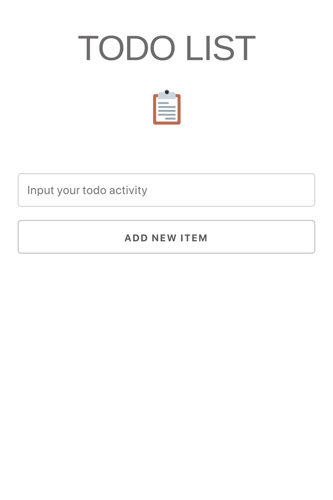
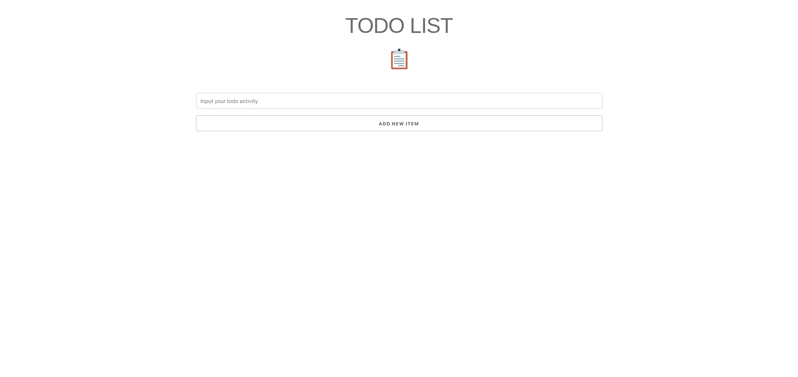

# Welcome to my ToDo built with SvelteKit and SkeletonCSS!
This is a simple ToDo application but with `SvelteKit` and `SkeletonCSS`.

## What's in this project?
-You can add to your ToDo by typing in the activity you wish to accomplish and click the ADD ToDo button.
-You can check the checkbox to the right of your ToDo to strikethrough it when you accomplish that task.
-You can also delete a ToDo if you wish to see it no more by clicking on the RED "🗙" on the right of the ToDo.

## View this app live and interact with it.

[Live Site](https://glitch.com) is a friendly community where millions of people come together to build web apps and websites.

